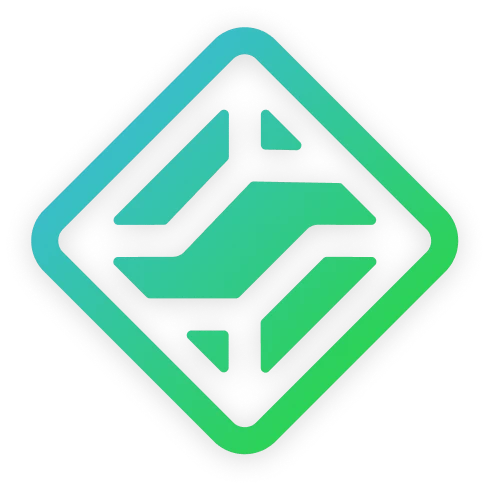

<div align="center">



# EmeraldNetwork

Empowering the World Through Innovative Networks, Shaping the Future of Connection, Intelligence, and Digital Possibility.

Built and maintained by [IceEmerald](https://github.com/IceEmerald).

[](https://developer.mozilla.org/en-US/docs/Web/HTML)
[](https://developer.mozilla.org/en-US/docs/Web/CSS)
[](https://developer.mozilla.org/en-US/docs/Web/JavaScript)

[](https://emeraldnetwork.groups.id)
[](https://github.com/IceEmerald/iceemerald.github.io/commits)

</div>

---

## Project overview

EmeraldNetwork is a static, multi-page ecosystem for personal projects, utilities, and public-facing experiences. The site is designed to be lightweight, CDN-friendly, and resilient when offline, while also supporting interactive web apps such as the AI chat interface and the presentation tooling.

### Included experiences

- Landing page and company/principles overview
- EmeraldBot AI chat and image workflows
- EmeraldSuite presentation/editor app
- Product and support pages
- Public notes and documentation
- Status monitoring and offline fallback pages

---

## Pages

| File | Purpose |
|------|---------|
| [`index.html`](index.html) | Home |
| [`about.html`](about.html) | About |
| [`aichat.html`](aichat.html) | AI Chat |
| [`slides.html`](slides.html) | Presentation app |
| [`notes.html`](notes.html) | Notes |
| [`emeraldsuite.html`](emeraldsuite.html) | EmeraldSuite |
| [`emeraldessentialsplugin.html`](emeraldessentialsplugin.html) | EmeraldEssentials |
| [`discordemeraldbot.html`](discordemeraldbot.html) | Discord bot overview |
| [`discordemeraldbotcmds.html`](discordemeraldbotcmds.html) | Bot commands |
| [`status.html`](status.html) | Service status |
| [`products.html`](products.html) | Product catalog |
| [`privacy.html`](privacy.html) | Privacy Policy |
| [`terms.html`](terms.html) | Terms of Service |
| [`404.html`](404.html) | Not found fallback |
| [`offline.html`](offline.html) | Offline response |

---

## Repository structure

```text
├── assets/
│   ├── data/
│   ├── images/
│   ├── scripts/
│   └── styles/
├── *.html
├── sw.js
├── robots.txt
├── sitemap.xml
├── SECURITY.md
├── README.md
└── CNAME
```

---

## Security and maintenance notes

- The project uses strict DOM-sanitization patterns for user-generated chat content.
- Service worker caches are intentionally versioned and purged on activation.
- Security reports should be sent privately rather than via public issues.

---

<div align="center">

Made with 💚 by [IceEmerald](https://github.com/IceEmerald)

</div>
